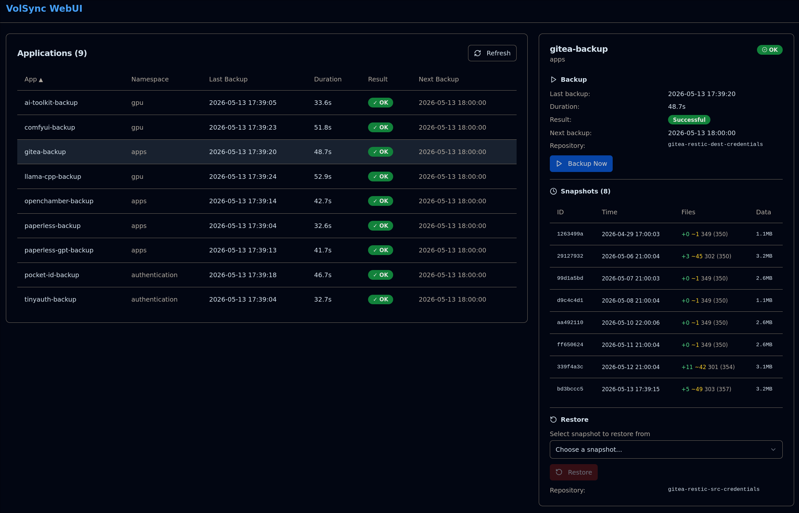

# VolSync WebUI

A web-based management interface for VolSync replication and backup operations on Kubernetes.

> [!WARNING]  
> The code was specificaly designed for my k8s setup. It is not a universal tool that covers every situation. If you would like to use this project, please review the conditions carefully or create a fork with the necessary modifications.



## Features

- **Dashboard Table**: View all ReplicationSources in a sortable table with status, last backup time, duration, and result
- **Detail Panel**: Click a row to see snapshot history, backup status, and restore controls
- **Backup Operations**: Trigger manual backups for individual apps
- **Restore Operations**: Restore from any available snapshot timestamp via the detail panel
- **Auto-Refresh**: Periodically updates the app list with configurable interval (default: 1 hour, no-overlap guard)
- **Manual Refresh**: Refresh button in header to fetch latest data on demand

## Deployment

A example deployment of this repository is in the `./example/` direcotry.

### Kubernetes

The container expects to run inside a Kubernetes cluster with access to the Kubernetes API.

Apply the RBAC configuration from the section below, then deploy the container:

```bash
# Create the ClusterRole and ClusterRoleBinding (see RBAC section below)
kubectl apply -f - <<EOF
# ... paste the YAML from the RBAC section ...
EOF
kubectl apply -f your-deployment.yaml
```

## RBAC Permissions

The ServiceAccount requires these permissions. Create a `ClusterRole` + `ClusterRoleBinding`:

```yaml
apiVersion: rbac.authorization.k8s.io/v1
kind: ClusterRole
metadata:
  name: volsync-webui
rules:
  - apiGroups: ["volsync.backube"]
    resources: ["replicationsources", "replicationdestinations", "replicationdestinations/status"]
    verbs: ["get", "list", "patch", "watch"]
  - apiGroups: [""]
    resources: ["pods", "pods/log"]
    verbs: ["get", "list", "create", "delete"]
  - apiGroups: [""]
    resources: ["namespaces"]
    verbs: ["get", "list"]
  - apiGroups: ["apps"]
    resources: ["deployments", "deployments/scale"]
    verbs: ["get", "list", "patch"]
  - apiGroups: ["helm.toolkit.fluxcd.io"]
    resources: ["helmreleases"]
    verbs: ["get", "list", "patch"]
  - apiGroups: [""]
    resources: ["persistentvolumeclaims"]
    verbs: ["get", "list"]
  - apiGroups: ["kustomize.toolkit.fluxcd.io"]
    resources: ["kustomizations"]
    verbs: ["get", "patch", "list"]
```

The app runs a startup RBAC check that probes each API endpoint and logs whether permissions are present. Missing permissions are non-fatal (logged as errors but the app continues).

## Environment Variables

| Variable | Default | Description |
|----------|---------|-------------|
| `RUST_LOG` | `info` | Logging level (trace, debug, info, warn, error) |
| `KUBERNETES_SERVICE_HOST` | auto-detected | Kubernetes API server host |
| `VOLSYNC_API_GROUP` | `volsync.backube` | API group for VolSync CRDs (set to `replication.storage.io` for older clusters) |
| `VOLSYNC_SOURCE_SUFFIX` | `-backup` | Suffix on ReplicationSource CRD names (e.g. `gitea-backup`) |
| `VOLSYNC_DEST_SUFFIX` | `-bootstrap` | Suffix on ReplicationDestination CRD names (e.g. `gitea-bootstrap`) |
| `VOLSYNC_PVC_SUFFIX` | `-pvc` | Suffix on PVC name (e.g. `gitea-pvc`). The PVC name is derived as `{base_app_name}{suffix}`. |
| `BACKUP_ALL_CONCURRENCY` | `5` | Max concurrent backups for backup-all |
| `POLL_TIMEOUT_SECS` | `300` | Backup/restore poll timeout in seconds |
| `POLL_INTERVAL_SECS` | `2` | Backup/restore poll interval in seconds |
| `POD_STARTUP_TIMEOUT_SECS` | `60` | Snapshot pod startup timeout in seconds |
| `RESTIC_IMAGE` | `restic/restic:latest` | Restic container image for snapshot pods |
| `VOLSYNC_KUSTOMIZATION_NAMESPACE` | `flux-system` | Namespace for Flux Kustomizations (suspend/unsuspend during restore) |

### Suffix Configuration

The app name shown in the dashboard is the ReplicationSource CRD name (e.g. `gitea-backup`).
The destination CRD name is derived by stripping `VOLSYNC_SOURCE_SUFFIX` and appending `VOLSYNC_DEST_SUFFIX`:

```
gitea-backup  → strips -backup  → gitea  → appends -bootstrap  → gitea-bootstrap
```

## Restore Workflow

The restore operation uses VolSync's `copyMethod: Direct` to write backup data directly into the application's existing PVC. This bypasses VolumeSnapshots entirely, making it compatible with all storage backends including OpenEBS ZFS LocalPV (where snapshots are destroyed when their parent PVC is deleted).

### Prerequisites

The application must be managed by a **Flux HelmRelease** (Kustomization support is optional but recommended). The ReplicationDestination CRD must exist and have `spec.trigger.manual` set by the HelmRelease values.

The PVC name must follow the convention: `{base_app_name}{VOLSYNC_PVC_SUFFIX}` (default `{app_name}-pvc`).

### Restore Flow

```
 0. Check HelmRelease exists (REQUIRED)               ← fail if missing
 0.5 Suspend Flux Kustomization (best-effort)          ← pauses GitOps reconciliation
 1. Suspend HelmRelease                                ← prevents Flux from reverting changes
 2. Scale down ALL deployments to 0                    ← detach app from PVC (multi-deployment safe)
 3. Save original RD fields:                           ← copyMethod, destinationPVC, restoreAsOf
 4. PATCH RD: copyMethod=Direct, destinationPVC=<pvc>  ← VolSync writes directly into app PVC
 5. PATCH RD: restoreAsOf=<timestamp> (if provided)
 6. Nullify status.lastManualSync                      ← triggers VolSync restore
 7. Poll until restore completes
 8. PATCH RD revert: restore original values           ← reverts copyMethod, destinationPVC, restoreAsOf
 9. Scale ALL deployments back to original replicas    ← pre-scales before Flux wakes up
10. Unsuspend HelmRelease                              ← Flux sees no drift
11. Unsuspend Kustomization (best-effort)              ← resumes GitOps reconciliation
```

The restore supports **multiple deployments per app** — all deployments matching `app.kubernetes.io/instance={base_app}` are scaled down and restored independently with their original replica counts.

### Storage Backend Compatibility

| Backend | Compatible | Notes |
|---------|-----------|-------|
| OpenEBS ZFS LocalPV | Yes | `copyMethod: Direct` writes directly into the app PVC, avoiding ZFS snapshot dependency issues |
| CSI drivers with working VolumePopulators | Yes | Works without snapshots |
| Any storage that supports PVC cloning | Yes | Direct method avoids cloning altogether |

**Important for ZFS users**: VolSync's default `copyMethod: Snapshot` creates a temporary PVC, restores data into it, takes a VolumeSnapshot, then deletes the temporary PVC. With OpenEBS ZFS, deleting the temp PVC destroys the ZFS dataset and its snapshots, making the snapshot unusable. `copyMethod: Direct` avoids this by writing directly into the application PVC.

### Error Handling

- If any step before the poll fails, the operation returns an error. The PVC and deployments are unchanged (restore was not triggered).
- If the restore poll fails (VolSync error or timeout), the ReplicationDestination spec still has `copyMethod: Direct` set. A subsequent retry will overwrite it. You can also trigger a HelmRelease reconciliation via Flux to reset the spec.
- If the RD revert fails after a successful restore, the data is already written to the PVC, but the ReplicationDestination spec may need manual cleanup (e.g., remove `copyMethod: Direct` and `destinationPVC`).

### Flux Kustomization Support

If your application is managed by a Flux Kustomization (e.g., in the `flux-system` namespace), set `VOLSYNC_KUSTOMIZATION_NAMESPACE` to the namespace where the Kustomization lives (default: `flux-system`). The restore will suspend the Kustomization to prevent GitOps reconciliation during the restore, then unsuspend it afterward.

The Kustomization name must match the base app name (e.g., app `gitea-backup` → base name `gitea` → Kustomization `gitea`).

### API Group Configuration

The default `VOLSYNC_API_GROUP=volsync.backube` matches modern VolSync installations. For older clusters still using the legacy API group, set:

```yaml
env:
  - name: VOLSYNC_API_GROUP
    value: "replication.storage.io"
```

## Kubernetes Compatibility

- Tested with Kubernetes 1.25+
- Uses `volsync.backube/v1alpha1` for VolSync CRDs (configurable via `VOLSYNC_API_GROUP`)
- Uses `helm.toolkit.fluxcd.io/v2` for HelmRelease (required for restore; backups work without it)

## Security Considerations

1. **ServiceAccount**: Runs with a dedicated SA, not default
2. **ClusterRole**: Requires broad read access — restrict in production
3. **No TLS**: Backend runs HTTP; TLS should be handled by ingress/controller
4. **No Authentication**: Currently no auth — expose via auth proxy (e.g., OAuth2 proxy) in production
5. **Secret Access**: Reads the actual secret name from `spec.restic.repository` on each ReplicationSource at snapshot time, so it always uses the correct credentials regardless of naming convention

## Developer Documentation

see `./docs`

## License

MIT
